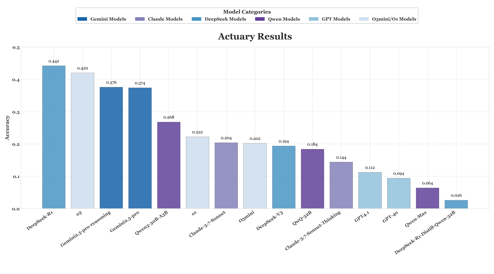

# ABench-Actuary
[](https://opensource.org/licenses/Apache-2.0)


## Overview

A curated set of 500 hard Actuary problems, generally on university actuarial disciplines and the content of domestic and international actuarial qualification examinations, covers Probability, Financial Mathematics, Fundamentals of Actuarial Mathematics, Advanced Long-Term Actuarial Mathematics, Advanced Short-Term Actuarial Mathematics, and more. This benchmark aims to provide a robust tool for evaluating the ability of large language models (LLMs) to understand, reason, and solve complex Actuary problems. Our benchmark contains 500 high-difficulty static pure-text Actuary problems.

## Key features

🛡️ **→ Contamination-proof**: All problems are rewritten by R1 to avoid potential contamination from the training data.

♻️ **→ Bilingual and Diverse Set**: Among the 500 actuarial problems, the questions are distributed from easy to difficult, covering multiple actuarial subjects. The problems are presented in both Chinese and English. The goal of this design is to ensure strong representativeness and diversity across different topics and difficulty levels.

🔎 **→ Expert-crunched**: Every single problem was solved by physicists to ensure correctness.

🤖 **→ RLVR-oriented**: Strictly calculation-based with unique answers of zero ambiguity within the answers.


## Liscense

We are releasing this project under the [Apache License 2.0](https://www.apache.org/licenses/LICENSE-2.0). This allows for both personal and commercial use, provided that the original license and copyright notice are included in any distributed copies or substantial portions of the software.


## Evaluation Metrics
Our evaluation focuses on the correctness of pure numerical answers. For each problem, the model's output is parsed, and its numerical answer is compared against the ground truth. A response is considered acceptable only if it satisfies both conditions: a numerical difference of no more than 0.01 and a percentage difference of no more than 0.1%.

## Main Results

| Models                                |   Accuracy |
|:--------------------------------------|-----------:|
| DeepSeek-R1                           |     0.442  |
| o3                                    |     0.420  |
| Gemini2.5-pro-reasoning               |     0.376  |
| Gemini2.5-pro                         |     0.374  |
| Qwen3-30B-A3B                         |     0.268  |
| o1                                    |     0.222  |
| Claude-3.7-Sonnet                     |     0.204  |
| O3mini                                |     0.202  |
| DeepSeek-V3                           |     0.194  |
| QwQ-32B                               |     0.184  |
| Claude-3.7-Sonnet-20250219-Thinking   |     0.144  |
| GPT4.1                                |     0.112  |
| GPT-4o                                |     0.094  |
| Qwen-Max                              |     0.064  |
| DeepSeek-R1-Distill-Qwen-32B          |     0.026  |

* Current SOTA models still struggle with our actuarial challenge benchmark, failing to reliably solve these problems.

## Data Structure
The dataset contains evaluation benchmarks for physics problems, divided into two main parts:
* data/Phy_A_fixed_400.csv: Contains 400 physics problems covering a wide range of fields, with difficulty levels progressing from high school-level foundational questions to university-level physics competition challenges. This section serves as a fixed benchmark for consistent evaluation.
  
    **scheme**
    | mid | standard_question | standard_answer    |
    |----|----------|---------------------|
    | 321 | question_text | answer_text |


## Usage Guide
1. Create an Environment Variables File (if you are using API models)
   ```
    API_KEY=<Your API Key>
    API_URL=<API Endpoint (if you are using a third-party API)
   ```
2. Install requirements
   ```
    pip install -r requirements.txt
   ```
3. Perform Evaluations Only

    If you have already generated LLM results and want to perform evaluations without re-running the model. First, please place the model's answers into a new column, following the format of Result_Actuary.csv. Then, simply execute the following command:
    ```
   python src/eval.py \
        --llm_response "R1_response" \
        --result_file  ./samples/Result_Actuary.csv
    ```

   --llm_response: specifies the name of the column in the CSV file where the model responses are stored (e.g., "R1_response").

   --result_file: the folder path, Result_Actuary.csv, where the results produced by the model are stored. This script will utilize these results for accuracy assessment.


## Example problems
```
Question:
An insurer has recorded the death ages of 10 policyholders as follows:
\[\begin{array}{llllllllll} {106} & {170} & {132} & {89} & {122} & {74} & {138} & {95} & {102} & {150} \end{array}\]
A new policyholder aged 100 is withdrawn from observation (right-censored) in an ongoing study. All lifetimes are assumed to be independent and identically distributed.
Using the Nelson-Aalen estimator, calculate the probability that this policyholder survives beyond age 125 given survival to age 100. (The final answer should have 4 decimal places)
Answer: 0.6008

Question:
已知以下生存概率（年概率）：
\[\begin{array}{c|c}
\text{年龄}x & {}_{5}q_{x} \\
\hline
55 & 0.1 \\
65 & 0.3 \\
\end{array}\]
\[\begin{array}{c|c}
\text{年龄}x & q_{x} \\
\hline
60 & 0.05 \\
70 & 0.08 \\
\end{array}\]
不同生命余命相互独立，求联合状态最后生存者死亡概率 \( {}_{5\mid}q_{\overline{55:65}} \)，定义为"两人均存活5年后，最后一人在第6年内死亡的概率"。（结果保留3位小数）
Answer: 0.022

Question:
假设(y)投保完全连续的一年期意外伤害保险，保险期限为1年，已知意外事故即刻赔付10万元，理赔处理费用为100元，年度连续缴纳毛保费2500元，年度管理费用为120元，并支付签单费用200元，已知一年内无意外发生概率 \( p_y = 0.99 \)，\(\delta = 0.05\) ，假设年内意外发生力恒定，以 \( h = 0.1\) 为步长，求在时间 \( t = 0.6 \) 时的责任准备金 \( _{t}V_{y} \)。（结果保留4位小数）
Answer: 836.8546

Question:
In a homeowners insurance policy, the building loss due to fire is uniformly distributed on the interval $[\mathbf{10}, \mathbf{c + 10}]$, and the contents loss is uniformly distributed on the interval $[\mathbf{5}, \mathbf{3c - 13}]$, where $c$ is a constant greater than 6.
The standard deviation of the building loss is $4 \sqrt{3}$.
Calculate the standard deviation of the contents loss. (The final answer should have 4 decimal places)
Answer: 15.5885

Question:
For a fully discrete deferred annuity with a single premium accumulation of 100,000 maturing in its fifth year, you are given the following contribution assumptions, reserve assumptions, and actual experience:

| | Contribution <br> Assumptions | Reserve <br> Assumptions | Actual <br> Experience |
| :--- | :---: | :---: | :---: |
| Contribution | 2625 | 2200 | 2625 |
| Interest | 0.05 | 0.04 | 0.045 |
| Mortality | 0.008 | 0.0154 | 0.005 |
| Withdrawal | 0.05 | 0.05 | 0.07 |
| Expense | 170 | 0 | 160 |
Reserve assumptions use the following double-decrement rates:
- Mortality rate (\(q_x^{(1)}\)): 0.0154
- Withdrawal rate (\(q_x^{(2)}\)): 0.0500
You are also given:
(i) The reserve at the end of the fourth year is 8000.
(ii) The cash surrender value at the end of the fifth year is 8500.
(iii) Gain by source is calculated in the order of expense, interest, mortality, withdrawal.
Calculate the gain per policy in the fifth year from withdrawal.
(The final answer should have 1 decimal places)
Answer: 24.1
```

