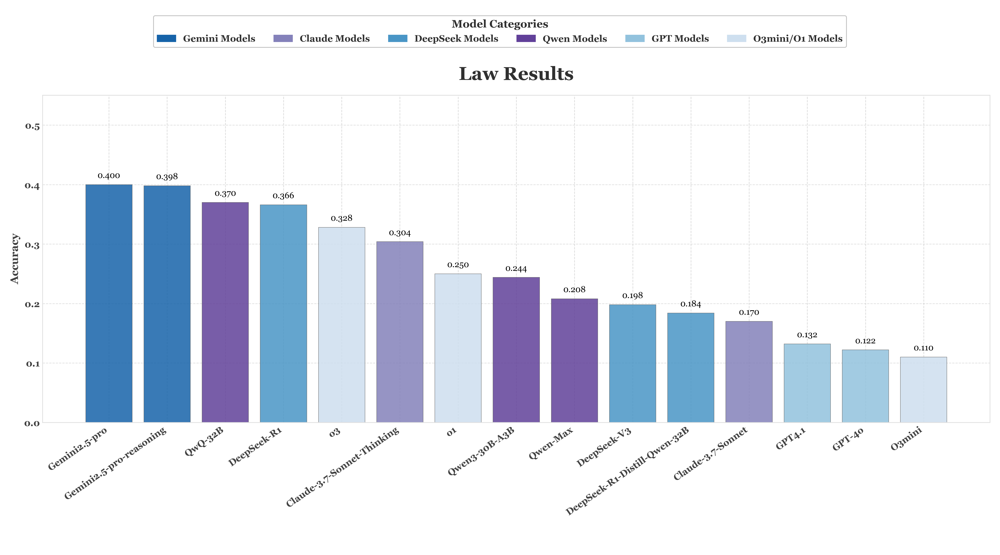

# ABench-Psychology
[](https://opensource.org/licenses/Apache-2.0)


## Overview
LawBench is a benchmark comprising 500 challenging legal questions designed to evaluate models' capabilities in law. The test includes Multiple-Choice Questions (MCQ) and Question Answering (QA). The 500 questions cover Civil Law, Civil Procedure Law, Criminal Law, Criminal Procedure Law, Administrative Law, and International Law. Knowledge points are derived from recent judicial examinations, and new questions are developed based on these points and thoroughly reviewed by experts for accuracy.

## Key features
🧠 **→ Test data leakage prevention:**:  Curated from over 10,000 authoritative questions and refined through model pre-screening, human cleaning, model rewrites, and expert verification, the dataset is designed to minimize any train–test leakage.

🛡️ **→ Expert-grade quality control**: Every question is created and repeatedly reviewed by experts under strict quality standards.

🤝  **→ RLVR-oriented**: Core knowledge points of judicial exams are retained while increasing question complexity to emphasize both depth and breadth.

📋️ **→ Precise evaluation**: Each short-answer question has a unique answer, which is simplified as much as possible during design so that a matching response is considered correct.


## Liscense

We are releasing this project under the [Apache License 2.0](https://www.apache.org/licenses/LICENSE-2.0). This allows for both personal and commercial use, provided that the original license and copyright notice are included in any distributed copies or substantial portions of the software.

We are releasing this project under the Creative Commons Attribution 4.0 International License (CC BY 4.0).

## Evaluation Metrics
We strictly use an "all or nothing" scoring mechanism, which means the model's answer is judged correct only when it completely matches the standard answer or scoring criteria. The specific accuracy standards vary depending on the question type：
* For Multiple-Choice Questions (MCQ): The answer is considered correct only when the option set completely matches the standard answer set.
* For Question Answering (QA): These questions require open-ended answers. We employ a model-as-judge to score the responses, strictly adhering to each item outlined in the LLM_judge_promt. 

## Main Results

| Models                                |   Accuracy |
|:--------------------------------------|-----------:|
| Gemini2.5-pro                         |     0.400  |
| Gemini2.5-pro-reasoning               |     0.398  |
| QwQ-32B                               |     0.370  |
| DeepSeek-R1                           |     0.366  |
| o3                                    |     0.328  |
| Claude-3.7-Sonnet-20250219-Thinking   |     0.304  |
| o1                                    |     0.250  |
| Qwen3-30B-A3B                         |     0.244  |
| Qwen-Max                              |     0.208  |
| DeepSeek-V3                           |     0.198  |
| DeepSeek-R1-Distill-Qwen-32B          |     0.184  |
| Claude-3.7-Sonnet                     |     0.170  |
| GPT4.1                                |     0.132  |
| GPT-4o                                |     0.122  |
| O3mini                                |     0.110  |


* Current SOTA models still struggle with our psychology challenge benchmark, failing to reliably solve these problems.


## Data Structure
The dataset contains 500 legal questions, provided as structured plain-text files: 180 QA and 320 multiple-choice (MCQ).The QA entries are designed for tasks where the model generates open-ended answers, with scoring based on the standard answers.The MCQ entries are designed for tasks where the model must select the correct option from a given list. For this question type, there is one and only one correct answer.

**scheme**
   | mid | standard_question | standard_answer   | type | is_order  | 
   |----|----------|---------------------|------------|-------------|
   | 321 | question_text | answer_text | QA | YES |


## Usage Guide
1. Create an Environment Variables File (if you are using API models)
   ```
    API_KEY=<Your API Key>
    API_URL=<API Endpoint (if you are using a third-party API)>
   ```
2. Install requirements
   ```
    pip install -r requirements.txt
   ```
3. Perform Evaluations Only

     If you have already generated LLM results and want to perform evaluations without re-running the model. First, please place the model's answers into a new column, following the format of Result_Law.csv. Then, simply execute the following command:

    ```
   python src/eval.py \
        --llm_response "R1_response" \
        --result_file  ./samples/Result_Law.csv \
        --output_file ../evaluation_details.csv
    ```


   --llm_response: specifies the name of the column in the CSV file where the model responses are stored (e.g., "R1_response").

   --result_file: the folder path, where the results produced by the model are stored. This script will utilize these results for accuracy assessment.
   

## Example problems
#### Multiple-Choice Questions
```
Question: 某市城建集团项目经理甲（男，45岁，本科学历，籍贯江南省白河市，性格谨慎，业余爱好钓鱼），利用职务便利在2021年3月至2023年6月期间，通过签订虚假工程咨询合同（合同名称为《绿城项目技术指导协议》，共8页，于2022年9月15日在城建集团三楼会议室签署，见证人为秘书小王，交付过程采用顺丰快递寄送）的方式多次收受贿赂。2023年7月12日星期三下午3时许，阴天伴有间断小雨，甲因下属乙（男，28岁，助理工程师，习惯穿白色安踏运动鞋和灰色棉质休闲裤）向纪检部门举报其违法行为，在城建集团办公楼506办公室（内部铺有米色大理石地砖，墙面悬挂工程规划图，配有红木办公桌和黑色皮质转椅）内来回踱步三圈后，用华为Mate40手机联系社会人员张某，压低声音说道：”天黑前把事办妥，别用上次那辆白色面包车“。次日凌晨，乙在回家途经光明路与枫林街交叉口时，被张某持钢管击打腿部致粉碎性骨折（经鉴定为重伤二级），期间乙的深蓝色帆布背包内装有未拆封的三只松鼠坚果礼盒掉落在地。关于本案庭前会议，下列哪些选项不正确？ 
A.甲可就案件管辖提出异议 
B.乙提起附带民事诉讼的，可调解 
C.甲提出其口供系刑讯所得，法官可在审查讯问时同步录像的基础上决定是否排除口供 
D.庭前会议上出示过的证据，庭审时举证、质证应简化
Answer: C D

Question: 某法学教授王某（45岁，中国人民大学法学博士，主要研究刑事诉讼法学领域），接受某平台的要求，为学员们提供刑事诉讼相关的直播课。王某在直播间开启了视频，将摄像头、音响等进行了调整，由直播间工作人员宣读了直播课的纪律后，直播正式开始。王某在网络直播过程中，与各听课的学员展开了积极的互动。在提到刑事诉讼的证明主体时，各学员纷纷在直播间中发表了各自的观点。 关于我国刑事诉讼的证明主体，下列选项是错误的是？ A.故意毁坏财物案中的附带民事诉讼原告人是证明主体 
B.侵占案中提起反诉的被告人是证明主体 
C.妨害公务案中就执行职务时目击的犯罪情况出庭作证的警察是证明主体
D.证明主体都是刑事诉讼主体  
Answer: C

```

#### Question Answering
```
Question: 河西省绿源市农机销售个体户李果（32岁，高中文化程度，性格急躁，业余爱好钓鱼和阅读农业科技杂志）。其父因心脏病住院治疗急需医疗费，李果决定出售自用的东方红牌红色联合收割机（七成新，购于2015年春，平时停放在绿源市农机市场东侧出租房内，该房为工业风格装修，墙面裸露红砖，地面堆放着二手农机零件和铁质货架）。2017年3月1日阴有小雨的上午9时许，李果在其出租房内用黑色英雄牌签字笔胁迫前来洽谈的张成（28岁，绿源市农资公司送货员）签订合同，约定货到付款，合同签订时窗外传来隔壁五金店的电钻声；4月1日多云转晴的下午3点，李果与程力在该出租房二手木桌前签订《收割机买卖合同》（共8页，见证人为市场保安赵斌，合同扫描件通过微信发送），程力当场支付20%货款；5月1日晴朗的周末上午，高进穿着深蓝色涤纶工装裤前往李果住处，在堆满农机维修手册的茶几上支付全款；6月1日闷热的傍晚，李果将擦拭一新的收割机交付给顾家，交付时收割机钥匙上挂着刻有“平安”字样的铜质钥匙扣。上述买受人均要求实际履行合同，就履行顺序产生争议。张成、程力、高进、顾家四人履行顺序是什么？
Answer:顾家、程力、高进、张成 


```


