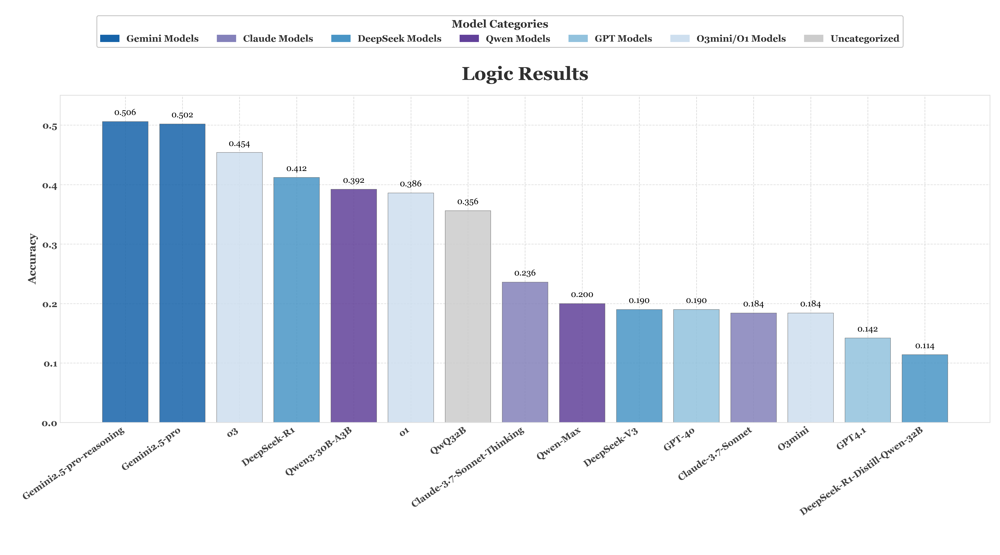

# ABench-Logic
[](https://opensource.org/licenses/Apache-2.0)


## Overview
State‑of‑the‑art LLMs still struggle with formal logic reasoning and fallacy detection. This benchmark addresses a critical gap often overlooked by traditional fact- or semantics-based evaluation suites. Based on the principle of validity, we release a 500‑item test suite of discrete logical problems. Each task requires a valid inference: premises → inference → conclusion. All problems come from high‑discrimination real‑world logic exams and pass multiple layers of manual curation.

## Key features

🧠️ **→ Expert-crunched**: Every single problem is produced and double‑checked by domain experts strictly adheres to rigorous quality standards.
 
🔒 **→ Contamination-proof**: To prevent data contamination, each problem is sourced from thousands of questions and undergoes a rigorous multi-stage verification pipeline by both models and experts.

🔗  **→ RLVR-oriented**: Items retain the structural complexity of premier logic reasoning exams, stressing deep logical inference instead of superficial pattern matching.

🎯️ **→ Accurate evaluation**: Based on the foundational principles of logic, an inference is considered valid if and only if its conclusion is necessarily true whenever its premises are true. Our evaluation directly measure the absolute correctness of the answer with a strict all-or-nothing scoring scheme.


## Liscense

We are releasing this project under the [Apache License 2.0](https://www.apache.org/licenses/LICENSE-2.0). This allows for both personal and commercial use, provided that the original license and copyright notice are included in any distributed copies or substantial portions of the software.

We are releasing this project under the Creative Commons Attribution 4.0 International License (CC BY 4.0).

## Evaluation Metrics
We employ a strict, all-or-nothing scoring mechanism, where no partial credit is awarded. A model's response is judged as correct only if it perfectly matches the ground-truth answer. The specific criteria for correctness vary by question type:
* For Multiple-Choice Questions (MCQ):  A response is considered correct if and only if the set of selected options is exactly identical to the set of ground-truth correct options.
* For Question Answering (QA):  The answers to these questions consist of words. A response is judged as correct only if it is an exact match to the standard answer. For questions where the sequence of words is semantically crucial (explicitly marked by an is-order flag in our dataset), this exact match criterion is also order-sensitive.

## Main Results

| Models                       |   Accuracy |
|:-----------------------------|-----------:|
| Gemini2.5-pro-reasoning      |     0.506  |
| Gemini2.5-pro                |     0.502  |
| o3                           |     0.454  |
| DeepSeek-R1                  |     0.412  |
| Qwen3-30B-A3B                |     0.392  |
| o1                           |     0.386  |
| QwQ-32B                      |     0.356  |
| Claude-3.7-Sonnet-Thinking   |     0.236  |
| Qwen-Max                     |     0.200  |
| DeepSeek-V3                  |     0.190  |
| GPT-4o                       |     0.190  |
| Claude-3.7-Sonnet            |     0.184  |
| O3mini                       |     0.184  |
| GPT4.1                       |     0.142  |
| DeepSeek-R1-Distill-Qwen-32B |     0.114  |


* Current SOTA models still struggle with our logical challenge benchmark, failing to reliably solve these problems.


## Data Structure
* The dataset contains 500 logical reasoning problems provided in a structured plain text file.The dataset has two distinct question formats: QA problems and MCQ. The QA entries are designed for tasks where the model must generate a specific word or ordered sequence of words as the answer.The MCQ entries are designed for tasks where the model must select the correct option(s) from a given list. For this question type, there may be one or more correct answers.This section serves as a fixed benchmark for consistent evaluation.
  
    **scheme**
    | mid | standard_question | standard_answer   | type | is_order  | 
    |----|----------|---------------------|------------|-------------|
    | 321 | question_text | answer_text | QA | YES |


## Usage Guide
1. Create an Environment Variables File (if you are using API models)
   ```
    API_KEY=<Your API Key>
    API_URL=<API Endpoint (if you are using a third-party API)
   ```
2. Install requirements
   ```
    pip install -r requirements.txt
   ```
3. Perform Evaluations Only

     If you have already generated LLM results and want to perform evaluations without re-running the model. First, please place the model's answers into a new column, following the format of Result_Logic.csv. Then, simply execute the following command:

    ```
   python src/eval.py \
        --llm_response "R1_response" \
        --result_file  ./samples/Result_Logic.csv
    ```

   --llm_response: specifies the name of the column in the CSV file where the model responses are stored (e.g., "R1_response").

   --result_file: the folder path, Result_Logic.csv, where the results produced by the model are stored. This script will utilize these results for accuracy assessment.


## Example problems
#### Multiple-Choice Questions
```
Question: In the mystical land of Eldoria, three wizards—Elara, Thorn, and Zara—each specialize in one of three magical disciplines: Chronomancer always tells the truth, Shadowweaver always lies, or Dreamweaver alternates between truth and lies. During a council, they make the following declarations:
Elara: (1) Thorn is a Chronomancer.(2) I am a Dreamweaver.
Thorn: (1) Elara is a Shadowweaver.(2) I am a Chronomancer.
Zara:(1) I am a Chronomancer.(2) Thorn is a Dreamweaver.
Based on the above information, which of the following can be determined to be false?
A、Elara is a Shadowweaver
B、Thorn is a Chronomancer
C、If Zara is  a Chronomancer, then Thorn is a Dreamweaver
D、If Zara is a  Shadowweaver, then Thorn is a Dreamweaver
E、Zara alternates between truth and lies
F、The statement of Thorn about Elara is true
G、The statement of Elara about Elara is true
Answer: B G
is-order: NO

Question: 在一个奇幻的世界里，有一群勇敢的冒险者，他们都拥有勇气和智慧的宝石。凡拥有勇气和智慧的宝石的冒险者，都有机会成为王国中的传奇英雄。并非所有来到魔法森林的冒险者都成为了传奇英雄；有一部分来自远方的王国勇士也成功成为了传奇英雄；由于某种神秘的原因，所有来自远方的王国勇士的家乡都没有派遣使者来到魔法森林。根据这段文字，不能判断正误的项是：
A、并非所有传奇英雄的家乡都派遣使者来到魔法森林
B、有些传奇英雄拥有勇气和智慧的宝石
C、有些冒险者的家乡也没有派遣使者来到魔法森林
D、所有冒险者都能成为传奇英雄
E、所有冒险者都有机会成为传奇英雄
F、部分来到魔法森林的冒险者已成为传奇英雄
G、部分来自远方的王国勇士已成为传奇英雄
H、所有来自远方的王国勇士的家乡未派遣使者至魔法森林
I、成为传奇英雄的来自远方的王国勇士，其家乡未派遣使者至魔法森林
Answer: D
is-order: NO

```


#### Question Answering
```
Question: Ten candidates Alex, Ben, Chris, David, Emily, Fiona, George, Harry, Ivy and Jack are seated in a Row which contains twelve seats. All the people facing the north direction and there are two vacant seats. Each of them likes different books such as Pride and Prejudice, Wuthering Heights, War and Peace, Crime and Punishment, One Hundred Years of Solitude, The Great Gatsby, Jane Eyre, Gone with the Wind, The Catcher in the Rye and The Old Man and the Sea. All the given information is not necessarily in the same order.Emily sits third to the left of one of the vacant seats. The only neighbor of the person who likes Gone with the Wind sits second to the left of Chris. David sits second to the right of one of the vacant seats. Ben does not like The Old Man and the Sea. Fiona sits immediate left of the person who likes Jane Eyre. There is no vacant seat at the extreme ends. The person who likes War and Peace and Crime and Punishment are immediate neighbors. Alex sits second to the left of Ben. The person who likes One Hundred Years of Solitude and The Great Gatsby are immediate neighbors. Only one person sits between Jack and one of the vacant seats. The person who likes Wuthering Heights and The Old Man and the Sea are immediate neighbors. George sits third from the left end and likes Jane Eyre. The person who likes Pride and Prejudice sits second to the right of one of the vacant seats. No person sits between Ben and Jack. Ivy neither likes The Old Man and the Sea nor War and Peace. There is one vacant seat between Harry and Ivy and no other person sits between them. No person sits between Alex and George. Five people are seated between two vacant seats. Jack is not a neighbor of Emily. David does not like Pride and Prejudice. Ben is not a neighbor of the vacant seat. Fiona likes The Great Gatsby. One of the immediate neighbors of Ben likes Wuthering Heights. Only one person sits to the left of Fiona.
Who is sitting third on the right of those who like "The Great Gatsby"
Answer: Alex
is-order：NO

Question: Ten candidates Alex, Ben, Chris, David, Emily, Fiona, George, Harry, Ivy and Jack are seated in a Row which contains twelve seats. All the people facing the north direction and there are two vacant seats. Each of them likes different books such as Pride and Prejudice, Wuthering Heights, War and Peace, Crime and Punishment, One Hundred Years of Solitude, The Great Gatsby, Jane Eyre, Gone with the Wind, The Catcher in the Rye and The Old Man and the Sea. All the given information is not necessarily in the same order.Emily sits third to the left of one of the vacant seats. The only neighbor of the person who likes Gone with the Wind sits second to the left of Chris. David sits second to the right of one of the vacant seats. Ben does not like The Old Man and the Sea. Fiona sits immediate left of the person who likes Jane Eyre. There is no vacant seat at the extreme ends. The person who likes War and Peace and Crime and Punishment are immediate neighbors. Alex sits second to the left of Ben. The person who likes One Hundred Years of Solitude and The Great Gatsby are immediate neighbors. Only one person sits between Jack and one of the vacant seats. The person who likes Wuthering Heights and The Old Man and the Sea are immediate neighbors. George sits third from the left end and likes Jane Eyre. The person who likes Pride and Prejudice sits second to the right of one of the vacant seats. No person sits between Ben and Jack. Ivy neither likes The Old Man and the Sea nor War and Peace. There is one vacant seat between Harry and Ivy and no other person sits between them. No person sits between Alex and George. Five people are seated between two vacant seats. Jack is not a neighbor of Emily. David does not like Pride and Prejudice. Ben is not a neighbor of the vacant seat. Fiona likes The Great Gatsby. One of the immediate neighbors of Ben likes Wuthering Heights. Only one person sits to the left of Fiona.
What is the order of these ten people from left to right?
Answer: Emily Fiona George Alex Jack Ben Chris Harry Ivy David
is-order: YES

Question: Ten candidates Alex, Ben, Chris, David, Emily, Fiona, George, Harry, Ivy and Jack are seated in a Row which contains twelve seats. All the people facing the north direction and there are two vacant seats. Each of them likes different books such as Pride and Prejudice, Wuthering Heights, War and Peace, Crime and Punishment, One Hundred Years of Solitude, The Great Gatsby, Jane Eyre, Gone with the Wind, The Catcher in the Rye 1and The Old Man and the Sea. All the given information is not necessarily in the same order.Emily sits third to the left of one of the vacant seats. The only neighbor of the person who likes Gone with the Wind sits second to the left of Chris. David sits second to the right of one of the vacant seats. Ben does not like The Old Man and the Sea. Fiona sits immediate left of the person who likes Jane Eyre. There is no vacant seat at the extreme ends. The person who likes War and Peace and Crime and Punishment are immediate neighbors. Alex sits second to the left of Ben. The person who likes One Hundred Years of Solitude and The Great Gatsby are immediate neighbors. Only one person sits between Jack and one of the vacant seats. The person who likes Wuthering Heights and The Old Man and the Sea are immediate neighbors. George sits third from the left end and likes Jane Eyre. The person who likes Pride and Prejudice sits second to the right of one of the vacant seats. No person sits between Ben and Jack. Ivy neither likes The Old Man and the Sea nor War and Peace. There is one vacant seat between Harry and Ivy and no other person sits between them. No person sits between Alex and George. Five people are seated between two vacant seats. Jack is not a neighbor of Emily. David does not like Pride and Prejudice. Ben is not a neighbor of the vacant seat. Fiona likes The Great Gatsby. One of the immediate neighbors of Ben likes Wuthering Heights. Only one person sits to the left of Fiona.
Who is sitting third on the right of those who like "Pride and Prejudice"?
Answer: Harry
is-order: NO

```


