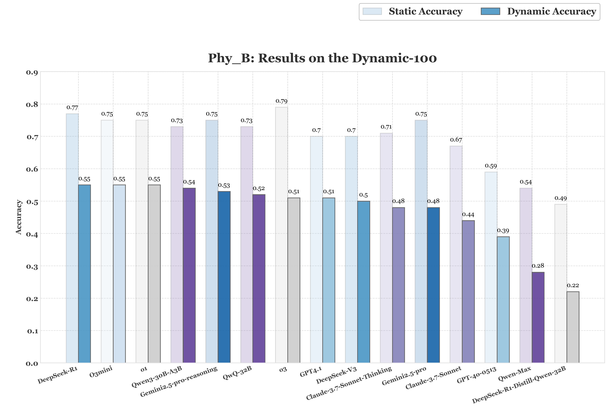

# ABench-Physics
[](https://opensource.org/licenses/Apache-2.0)


## Overview
A curated set of 500 hard physics problems, generally on university or competition level, convering classical mechanics, electromagnetism, optics, quantum physics, electrodynamics, semiconductor physics, fluid mechanics, atomic physics, modern physics, advanced physics, and more. This benchmark aims to provide a robust tool for evaluating the ability of large language models (LLMs) to understand, reason, and solve complex physics problems. Our benchmark consists of two parts: the Phy_A part containing 400 high-difficulty static pure-text physics problems, and the Phy_B section containing 100 dynamic low-difficulty physics problems with variable known condition values.

## Key features

🛡️ **→ Contamination-proof**: All problems are rewritten by R1 to avoid potential contamination from the training data.

♻️  **→ Static and Dynamic set**: Among the QA pairs, alongside the 400 problems being very much static, we further propose a auto-generation engine (upon releasement) .
The goal of the engine is to propose new variants of the problem sets by tweaking numbers in the core LaTeX equations in the solutions.

🔎 **→ Expert-crunched**: Every single problem was solved by physicists to ensure correctness.

🤖 **→ RLVR-oriented**: Strictly calculation-based with unique answers of zero ambiguity within the answers.


## Liscense

We are releasing this project under the [Apache License 2.0](https://www.apache.org/licenses/LICENSE-2.0). This allows for both personal and commercial use, provided that the original license and copyright notice are included in any distributed copies or substantial portions of the software.


## Evaluation Metrics
Our evaluation focuses on the correctness of pure numerical answers. For each problem, the model's output is parsed, and its numerical answer is compared against the ground truth. The responses with results within 1% of the standard answer are considered correct.
* Fixed 400-Problem Accuracy: This metric reports the overall accuracy on the Phy_A_fixed_400 dataset. It provides a stable and comparable measure of model performance over time.
* Dynamic 100-Problem Accuracy: This metric reports the accuracy on the Phy_B_dynamic dataset. As these problems change, a model must correctly answer all variations of a question to be considered as having correctly responded to that question. This metric reflects the model's adaptability and ongoing improvements in handling varied physics challenges.


## Main Results
#### Fixed 400-Problem

| Models                       |   Accuracy |
|:-----------------------------|-----------:|
| Gemini2.5-pro-reasoning      |     0.430  |
| o3                           |     0.378  |
| Gemini2.5-pro                |     0.345  |
| DeepSeek-R1-0528             |     0.343  |
| o1                           |     0.295  |
| O3mini                       |     0.283  |
| Claude-3.7-Sonnet-Thinking   |     0.220  |
| DeepSeek-V3                  |     0.215  |
| GPT4.1                       |     0.213  |
| Qwen3-30B-A3B                |     0.200  |
| Claude-3.7-Sonnet            |     0.175  |
| QwQ-32B                      |     0.125  |
| GPT-4o-0513                  |     0.100  |
| Qwen-Max                     |     0.083  |
| DeepSeek-R1-Distill-Qwen-32B |     0.023  |

* Current SOTA models still struggle with our physics challenge benchmark, failing to reliably solve these problems.

#### Dynamic 100-Problem

| Models                       |   Static Accuracy |   Dynamic Accuracy |
|:-----------------------------|------------------:|-------------------:|
| DeepSeek-R1-0528             |              0.77 |               0.55 |
| O3mini                       |              0.75 |               0.55 |
| o1                           |              0.75 |               0.55 |
| Qwen3-30B-A3B                |              0.73 |               0.54 |
| Gemini2.5-pro-reasoning      |              0.75 |               0.53 |
| QwQ-32B                      |              0.73 |               0.52 |
| o3                           |              0.79 |               0.51 |
| GPT4.1                       |              0.70 |               0.51 |
| DeepSeek-V3                  |              0.70 |               0.50 |
| Claude-3.7-Sonnet-Thinking   |              0.71 |               0.48 |
| Gemini2.5-pro                |              0.75 |               0.48 |
| Claude-3.7-Sonnet            |              0.67 |               0.44 |
| GPT-4o-0513                  |              0.59 |               0.39 |
| Qwen-Max                     |              0.54 |               0.28 |
| DeepSeek-R1-Distill-Qwen-32B |              0.49 |               0.22 |

* Although the problems were not particularly challenging, after altering the numerical values in the questions, all models exhibited an average performance drop of 22.5%, with the most severe case declining by 28%.​
* RL-trained models demonstrate better performance on dynamic problems, while those SFT-tuned models tend to rank lower.


## Data Structure
The dataset contains evaluation benchmarks for physics problems, divided into two main parts:
* data/Phy_A_fixed_400.csv: Contains 400 physics problems covering a wide range of fields, with difficulty levels progressing from high school-level foundational questions to university-level physics competition challenges. This section serves as a fixed benchmark for consistent evaluation.
  
    **scheme**
    | mid | standard_question | standard_answer    |
    |----|----------|---------------------|
    | 321 | question_text | answer_text |

* data/Phy_B_dynamic_100.csv: This section contains 100 physics problems that are regularly updated. These problems offer a dynamic challenge, reflecting new insights and varied problem-solving scenarios, allowing for continuous assessment of model improvements. 

    **scheme**
    | mid | subid | standard_question | standard_answer    |
    |----|----|----------|---------------------|
    | 223 | 1   |question_text | answer_text |

    * Each problem (MID) contains multiple sub-questions (SubIDs). The model is only credited with a correct response when all SubIDs under a given MID are answered correctly.


## Usage Guide
1. Create an Environment Variables File (if you are using API models)
   ```
    API_KEY=<Your API Key>
    API_URL=<API Endpoint (if you are using a third-party API)
   ```
2. Install requirements
   ```
    pip install -r requirements.txt
   ```
3. Perform Evaluations Only

     If you have already generated LLM results and want to perform evaluations without re-running the model. First, please place the model's answers into a new column, following the format of Result_Phy_A_fixed_400.csv. Then, simply execute the following command:

    ```
   python src/eval.py \
        --llm_response "R1_response" \
        --result_file  ./samples/Result_Phy_A_fixed_400.csv
    ```

   --llm_response: specifies the name of the column in the CSV file where the model responses are stored (e.g., "R1_response").

   --result_file: the folder path, Result_Phy_A_fixed_400.csv, where the results produced by the model are stored. This script will utilize these results for accuracy assessment.


## Example problems
#### Fixed 400-Problem
```
Question:
Due to the effect of aberration of light, when the Earth observes stars, the apparent positions of the stars within the ecliptic plane undergo periodic shifts because of the Earth's orbital motion. The amplitude of this apparent oscillation angle is \( \delta \theta = 41'' \). Calculate the orbital velocity of the Earth. (Results should be expressed with units of $ \mathrm{\;{km}}/\mathrm{s} $,and rounded to 2 significant figures)

Answer: 30
```


#### Dynamic 100-Problem
```
Question: 
某质点沿 \( X \) 轴作直线运动，受力 \( \mathrm{F} = \left( {5x + 4} \right) \mathrm{{iN}} \)。试求质点从 \( {x}_{0} = 0 \) 移动到 \( x = {10}\mathrm{\;m} \) 的过程中,该力作功多少? (结果以$ \mathrm{\;J} $为单位，保留3位有效数字)
Answer: 290

Question: 
某质点沿 \( X \) 轴作直线运动，受力 \( \mathrm{F} = \left( {7x + 4} \right) \mathrm{{iN}} \)。试求质点从 \( {x}_{0} = 0 \) 移动到 \( x = {10}\mathrm{\;m} \) 的过程中,该力作功多少? (结果以$ \mathrm{\;J} $为单位，保留3位有效数字)
Answer: 390

Question: 
某质点沿 \( X \) 轴作直线运动，受力 \( \mathrm{F} = \left( {5x + 5} \right) \mathrm{{iN}} \)。试求质点从 \( {x}_{0} = 0 \) 移动到 \( x = {10}\mathrm{\;m} \) 的过程中,该力作功多少? (结果以$ \mathrm{\;J} $为单位，保留3位有效数字)
Answer: 300

Question: 
某质点沿 \( X \) 轴作直线运动，受力 \( \mathrm{F} = \left( {6x + 8} \right) \mathrm{{iN}} \)。试求质点从 \( {x}_{0} = 0 \) 移动到 \( x = {10}\mathrm{\;m} \) 的过程中,该力作功多少? (结果以$ \mathrm{\;J} $为单位，保留3位有效数字)
Answer: 380
```


## 🚩 Citation
If you use ABench-Physics in your research, please cite our work:
```bibtex
@misc{zhang2025abenchphysicsbenchmarkingphysicalreasoning,
      title={ABench-Physics: Benchmarking Physical Reasoning in LLMs via High-Difficulty and Dynamic Physics Problems}, 
      author={Yiming Zhang and Yingfan Ma and Yanmei Gu and Zhengkai Yang and Yihong Zhuang and Feng Wang and Zenan Huang and Yuanyuan Wang and Chao Huang and Bowen Song and Cheng Lin and Junbo Zhao},
      year={2025},
      eprint={2507.04766},
      archivePrefix={arXiv},
      primaryClass={cs.LG},
      url={https://arxiv.org/abs/2507.04766}, 
}

