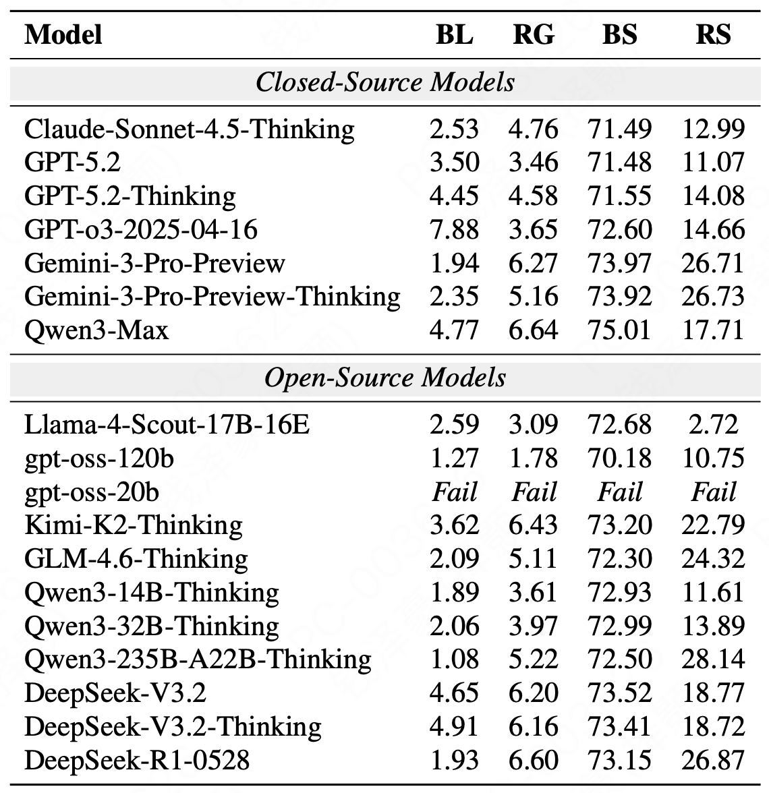
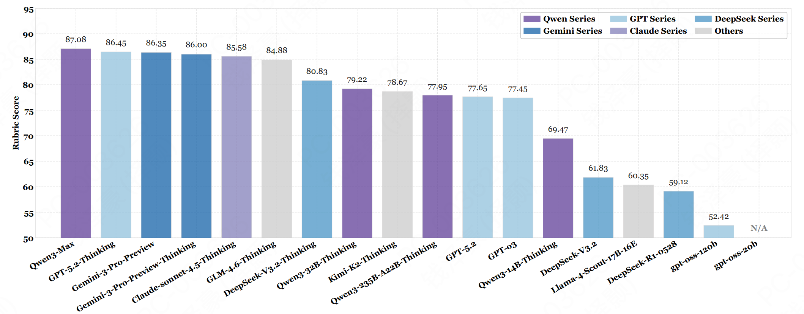
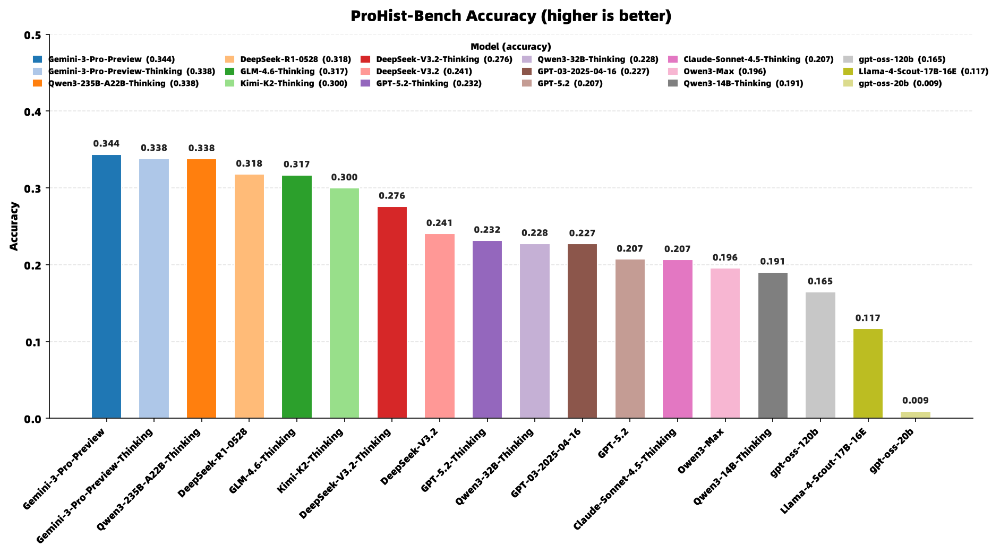

# ProHist-Bench

> **Can LLMs Act as Historians? Evaluating Historical Research Capabilities of LLMs via the Chinese Imperial Examination**
> 📄 [ACL 2026 (Main)](https://aclanthology.org/2026.acl-long.1378.pdf)

<p align="center">
  <a href="https://aclanthology.org/2026.acl-long.1378.pdf"></a>
  <a href="https://github.com/inclusionAI/ABench/tree/main/ProHist-Bench"></a>
  
  
</p>

---

## 📰 Introduction

**ProHist-Bench** is the first LLM benchmark designed for **professional historical research**. It is anchored in the **Chinese Imperial Examination (Keju)** system — a 1,300-year-old institution that acts as a microcosm of East Asian political, social, and intellectual history. Built through deep collaboration between AI researchers and professional historians, ProHist-Bench poses a central question:

> Can current LLMs perform like true historians — conducting source-grounded evidentiary reasoning, integrating historical perspectives, and arguing across contexts — rather than merely recalling historical knowledge?

This repository releases two versions of the benchmark:

| Version | #Questions | Description |
|:---:|:---:|:---|
| **ProHist-Bench-400** | **400** | **The main version reported in the paper** (4 task types; no multiple-choice questions). This README is centered on this version. |
| **ProHist-Bench-504** | **504** | An extended version that additionally introduces multiple-choice, source-text analysis, source-text authentication, and imperial examination paper analysis tasks. |

---

## 📊 Results

The paper evaluates 18 LLMs on ProHist-Bench (7 closed-source + 11 open-source). **For the 400-question version, the results are presented in two parts:**

**① T1–T3: Automatic Metrics + Rubric Score**

<p align="center">
  
</p>


**② T4: Celun Generation — Rubric Score Ranking**

<p align="center">
  
</p>

---

### Extended 504-Question Results

The 504-question version augments the 400 questions with multiple-choice, source-text analysis and authentication, and imperial examination paper analysis tasks. The overall results are shown below:

<p align="center">
  
</p>
<p align="center"><em>Figure: Overall results of the extended 504-question version.</em></p>

---

## 🧮 Dataset Structure

### Four Core Task Types

ProHist-Bench is organized around four task types of increasing difficulty (naming follows Table 1 of the paper):

| Task ID | Task Name (Paper) | `category` Field | #Questions (400) |
|:---:|:---|:---:|:---:|
| **T1** | **Term Interpretation** | `名词解释` | 90 |
| **T2** | **Fact QA** | `简答题` | 150 |
| **T3** | **Historical Reasoning** | `论述题` | 120 |
| **T4** | **Celun Generation** | `策论题` | 40 |

> The **504-question version** additionally introduces 选择题 (multiple-choice), `史料分析题` (source-text analysis), `史料考辨题` (source-text authentication), and `科举试卷分析` (examination paper analysis).

### Nine Historical Research Capability Dimensions (Rubric Dimensions)

Each question is accompanied by **fine-grained rubrics hand-crafted by historians**, totaling **10,891 criteria** across nine capability dimensions ( denoted R1–R9):

| Dimension | Description | Applicable Tasks |
|:---:|:---|:---:|
| R1 Concept Definition | Definition of historical concepts | T1–T3 |
| R2 Fact Organization | Organization and presentation of historical facts | T1–T3 |
| R3 Historical Comparison | Comparative historical analysis | T1–T3 |
| R4 Evidentiary Reasoning | Source-grounded reasoning with evidence | T1–T3 |
| R5 Comprehensive Evaluation | Holistic scholarly assessment | T1–T3 |
| R6 Viewpoint Integration | Integration of diverging scholarly viewpoints | T1–T3 |
| R7 Academic Expression | Academic writing quality | T1–T3 |
| R8 Classical Writing | Classical-literary / eight-legged-essay (baguwen) writing | T4 |
| R9 Temporal Reframing | Re-anchoring within dynasty-specific contexts | T4 |

---

## 🗂 Code Structure

```
ProHist-Bench/
├── data/
│   ├── ProHist-Bench-400.json     # 400 questions (main version in the paper)
│   └── ProHist-Bench-504.json     # 504 questions (extended version)
├── samples/
│   ├── Result_ProHist-Bench-400.csv  
│   └── Result_ProHist-Bench-504.csv
├── src/
│   ├── eval.py        # Main scoring script (the judge)
│   └── utils.py       
├── img/
│   ├── ProHist-Bench_400_T1-3.png  
│   ├── ProHist-Bench_400_T4.png   
│   └── ProHist-Bench_504.png       
├── LLM_judge_prompt.txt         # LLM-as-a-judge prompt template
└── README.md
```

## 🚀 Quick Start

### 1. Install Dependencies

```bash
pip install pandas openai
```

### 2. Run Evaluation

```bash
cd src

python eval.py \
  --api_key "sk-xxxxxxxx" \
  --api_base "https://api.deepseek.com" \
  --result_file "../samples/Result_ProHist-Bench-400.csv" \
  --llm_response_col R1_response \
  --judge_model deepseek-r1-250528 \
  --output_file "../samples/Result_ProHist-Bench-400_scored.csv"
```

---

## 📁 Dataset Examples

A **T4 baguwen (八股文)** example from `data/ProHist-Bench-400.json` (key fields shown):

```json
{
  "id": 1,
  "category": "八股文",
  "question": "假设你是一位清朝乾隆辛丑科（乾隆四十六年）的科举考生，请你严格按照八股文的写作方式写一篇科场八股文，如果遇到需要避讳的字，以拼音标注。字数不要超过700字。请直接作答，仅输出你写的八股文，不要输出其他内容。题目是：孟子曰：待文王而后兴者，凡民也。",
  "length_constraint": 700,
  "examination_category": "会试",
  "exam_session": "乾隆四十六年辛丑科",
  "name_of_reference_essay": "王鸿中",
  "rank_of_reference_essay": "第二十六名",
  "references": "顾廷龙主编：《清代朱卷集成》第3册，台北：成文出版社，1992年。",
  "rubrics": "加分项：\n1、文章包括：破题、承题、起讲、入题四个环节。{+5}\n2、破题：即说出这次要讲的内容是什么？只有2-3句。概括题意，但不能直说题意。不能重复、泄漏题目。{+3}\n ... \n减分项：\n1、文风凄婉、凄怆、谲狂、悲慨、疏野、旷达。{-40}\n2、文章字数超过七百字。{-60}\n3、未对'玄''烨''丘''胤''禛''弘''历'以拼音标注避讳。{-60}。",
  "rubric_axis": { "加分项": [ { "index": 1, "dimension": "历史语境代入能力", "reason": "..." }, ... ] },
  "original_essay_answer_of_qing_dinasty_gongshi": "民有待而興非大賢之所望也夫必待文王而興則不能自興矣 ..."
}
```

A **T1 Term Interpretation (名词解释)** example (excerpt):

```json
{
  "id": 41,
  "category": "名词解释",
  "question": "对举人进行名词解释",
  "rubrics": "加分项：1、答出举人指举到之人，后指参加科举考试的考生。{+5} ... 减分项：...",
  "reference_answer": "举人指举到之人，后指参加科举考试的考生。汉代察举各地郡国守相荐举士子的行为称为举人 ...",
  "rubric_axis": { ... }
}
```

A **multiple-choice (选择题)** example from the 504-question version (excerpt; gold answer is `ADEF`):

```json
{
  "id": 460,
  "category": "选择题",
  "question": "以下关于秀才科的说法，有哪些选项是不正确的？ A. 秀才之名渊源于唐代秀才特科 ... F. 明代秀才科与进士、明经并列为岁举常科 ...",
  "answer": "ADEF",
  "answer_explanation": "ADEF  秀才科是中国古代科举考试的科目之一 ...",
  "level_of_difficulty": "Hard"
}
```

---

## 📝 Citation

If you find this repository helpful for your research, please cite:

```bibtex
@inproceedings{gao-etal-2026-llms,
    title = "Can {LLM}s Act as Historians? Evaluating Historical Research Capabilities of {LLM}s via the {C}hinese Imperial Examination",
    author = "Gao, Lirong  and
      Wang, Zeqing  and
      Cai, Yuyan  and
      Deng, Jiayi  and
      Gu, Yanmei  and
      Zhang, Yiming  and
      Zhou, Jia  and
      Zhang, Yanfei  and
      Zhao, Junbo",
    editor = "Liakata, Maria  and
      Moreira, Viviane P.  and
      Zhang, Jiajun  and
      Jurgens, David",
    booktitle = "Proceedings of the 64th Annual Meeting of the {A}ssociation for {C}omputational {L}inguistics (Volume 1: Long Papers)",
    month = jul,
    year = "2026",
    address = "San Diego, California, United States",
    publisher = "Association for Computational Linguistics",
    url = "https://aclanthology.org/2026.acl-long.1378/",
    doi = "10.18653/v1/2026.acl-long.1378",
    pages = "29880--29911",
    ISBN = "979-8-89176-390-6"
}
```

---

<p align="center"><em>ProHist-Bench — Letting LLMs sit for the 1,300-year imperial examination and, for once, act as historians.</em></p>