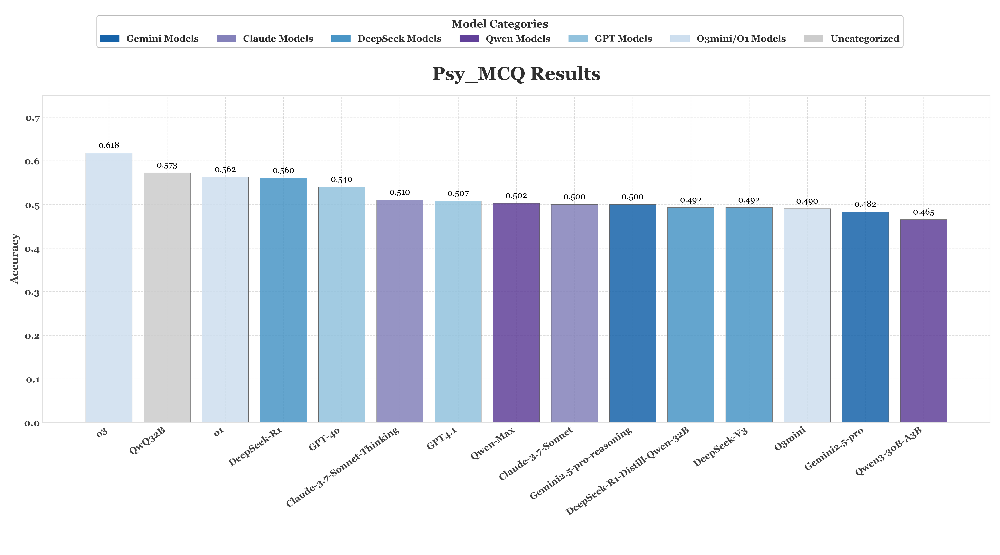
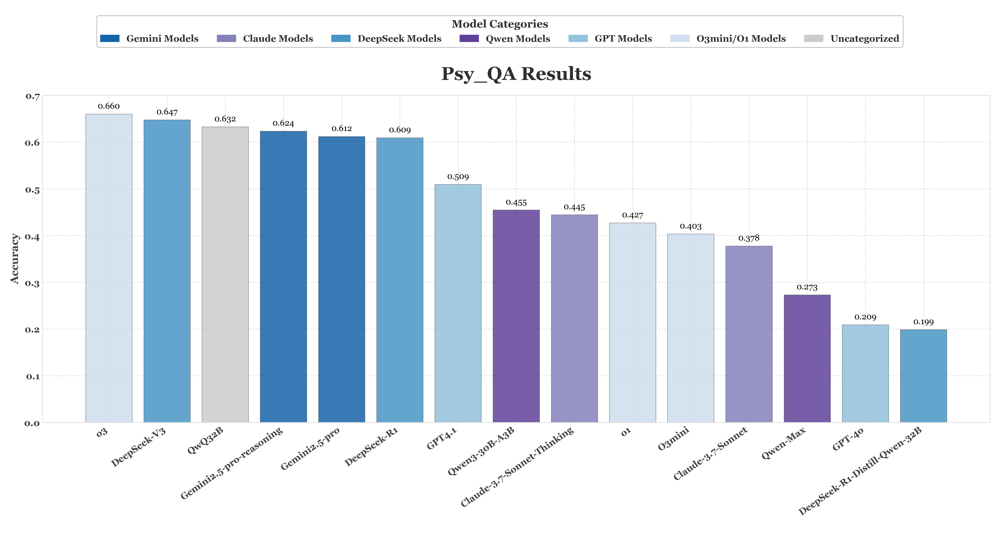

# ABench-Psychology
[](https://opensource.org/licenses/Apache-2.0)


## Overview
PsychBench is a benchmark comprising 510 challenging psychology questions designed to evaluate a model's capabilities in Theory of Mind and empathetic support. It consists of both objective questions and subjective questions. The 400 objective questions are advanced Theory of Mind tests, covering various aspects of everyday life, such as social commonsense and emotional analysis. The subjective portion consists of 110 psychological counseling case studies selected from China's National Psychological Counselor Certification Exam. For these cases, experts have crafted new questions across five distinct scenarios. The answers are then evaluated using an evaluation rubric developed by experts.

## Key features
🧠 **→ Expert‑crunched**: Every single problem is produced and double‑checked by domain experts strictly adheres to rigorous quality standards.

🛡️ **→ Contamination-proof**: Selected from tens of thousands of authoritative questions, then filtered via model pre‑screening, human cleaning, model rewriting, and expert verification to block training‑set leakage.

🤝  **→ RLVR-oriented**: Items retain the structural complexity of premier Psychological Counselor Certification Exam, emphasizing deep analysis rather than superficial support.

📋️ **→ Accurate evaluation**: A rubric-based evaluation system for 110 subjective psychological counseling case questions: The system aims to quantify the quality of the model's answers in this field from the perspective of psychological counseling experts, covering specific details exclusive to the case one-on-one.


## Liscense

We are releasing this project under the [Apache License 2.0](https://www.apache.org/licenses/LICENSE-2.0). This allows for both personal and commercial use, provided that the original license and copyright notice are included in any distributed copies or substantial portions of the software.

We are releasing this project under the Creative Commons Attribution 4.0 International License (CC BY 4.0).

## Evaluation Metrics
We employ a strict, all-or-nothing scoring mechanism, where a model's response is judged as correct only if it perfectly matches the ground-truth answer or the rubric. The specific criteria for correctness vary by question type:
* For Multiple-Choice Questions (MCQ): A response is considered correct if and only if the set of selected options is exactly identical to the set of ground-truth correct options.
* For Question Answering (QA): These questions require open-ended answers. We employ a model-as-judge to score the responses, strictly adhering to each item outlined in the rubric. Credit for a specific item is awarded only for a perfect match, and penalties are imposed for any negative components in the response. Please note that the core objective of these questions is to make the model's responses more human-like and empathetic.

## Main Results
#### Multiple-Choice Questions

| Models                       |   Accuracy |
|:-----------------------------|-----------:|
| o3                           |     0.6175 |
| QwQ-32B                      |     0.5725 |
| o1                           |     0.5625 |
| DeepSeek-R1                  |     0.5600 |
| GPT-4o                       |     0.5400 |
| Claude-3.7-Sonnet-Thinking   |     0.5100 |
| GPT4.1                       |     0.5075 |
| Qwen-Max                     |     0.5025 |
| Claude-3.7-Sonnet            |     0.5000 |
| Gemini2.5-pro-reasoning      |     0.5000 |
| DeepSeek-R1-Distill-Qwen-32B |     0.4925 |
| DeepSeek-V3                  |     0.4925 |
| O3mini                       |     0.4900 |
| Qwen3-30B-A3B                |     0.4650 |
| Gemini2.5-pro                |     0.4825 |


#### Question Answering

| Models                       |   Accuracy |
|:-----------------------------|-----------:|
| o3                           |     0.6596 |
| DeepSeek-V3                  |     0.6475 |
| QwQ-32B                      |     0.6325 |
| Gemini2.5-pro-reasoning      |     0.6235 |
| Gemini2.5-pro                |     0.6119 |
| DeepSeek-R1                  |     0.6090 |
| GPT4.1                       |     0.5094 |
| Qwen3-30B-A3B                |     0.4547 |
| Claude-3.7-Sonnet-Thinking   |     0.4445 |
| o1                           |     0.4270 |
| O3mini                       |     0.4034 |
| Claude-3.7-Sonnet            |     0.3775 |
| Qwen-Max                     |     0.2729 |
| GPT-4o                       |     0.2088 |
| DeepSeek-R1-Distill-Qwen-32B |     0.1985 |


* Current SOTA models still struggle with our psychology challenge benchmark, failing to reliably solve these problems.


## Data Structure
The dataset contains 510 psychology problems provided in a structured plain text file, including 110 QA questions and 400 MCQs.
* The QA entries are designed for tasks where the model generates open-ended answers, which are then evaluated for quality against our provided evaluation rubric.

    **scheme**
    | mid | standard_question | rubric   | type | 
    |----|----------|---------------------|------------|
    | 123 | question_text | rubric_text | QA |

* The MCQ entries are designed for tasks where the model must select the correct option from a given list. For this question type, there is one and only one correct answer.
    
   **scheme**
    | mid | standard_question | standard_answer   | type | 
    |----|----------|---------------------|------------|
    | 132 | question_text | answer_text | MCQ |


## Usage Guide
1. Create an Environment Variables File (if you are using API models)
   ```
    API_KEY=<Your API Key>
    API_URL=<API Endpoint (if you are using a third-party API)
   ```
2. Install requirements
   ```
    pip install -r requirements.txt
   ```
3. Perform Evaluations Only

     If you have already generated LLM results and want to perform evaluations without re-running the model. First, please place the model's answers into a new column, following the format of Result_MCQ.csv. Then, simply execute the following command:

    ```
   python src/eval.py \
        --eval_type "mcq" \
        --llm_response "R1_response" \
        --result_file  ./samples/Result_MCQ.csv
    ```
   --eval_type: specifies the evaluation method: mcq or qa.

   --llm_response: specifies the name of the column in the CSV file where the model responses are stored (e.g., "R1_response").

   --result_file: the folder path, Result_MCQ.csv, where the results produced by the model are stored. This script will utilize these results for accuracy assessment.


## Example problems
#### Multiple-Choice Questions
```
Question: 周五下午放学后，小琳和小辉原本约定一起去图书馆温习功课。小辉原本计划同好友观看一场电影，但他推掉了这个活动，转而陪伴小琳前去复习。当他们终于抵达图书馆门口时，小琳抬头瞥见小辉的身影，微带埋怨地低语道：“你终于出现了。”小辉略显窘迫地回答：“抱歉，我在路上被些琐事耽搁了。”紧接着，小琳补充说道：“这次希望你用心一点，别跟上回似的草率对待。”然后，两人便坐下开始专心复习。与此同时，小琳的闺蜜悄悄提醒她：“小辉上周刚帮你修改过数学作业。” 而小辉的好友低声说：“他推掉电影是为了陪你，但你从未公开感谢过他。” 
从社会交换理论的角度看，以下哪句话最能体现互惠原则的失衡？ 
A. 你终于出现了。 
B. 抱歉，我在路上被些琐事耽搁了。
C. 这次希望你用心一点，别跟上回似的草率对待。 
D. 故事中没有不合适的句子。 
E. 小辉推掉电影是为了陪你，但你从未公开感谢过他。 
F. 小琳的埋怨可能掩盖了对小辉付出的忽视。 
G. 小辉的解释可能未触及核心问题（如频繁迟到）。 
H. 小琳的闺蜜提醒揭示了潜在的情感不对等。
Answer: C

Question: 周三，尽管学校规定只有周五能带玩具，三年级的小涛还是没忍住，将他生日新得的蓝色玩具直升机带到了教室。同桌小宇和小颖都由衷地赞叹着“真酷！”、“颜色好特别！”。小涛正为此感到高兴时，班里的“科技小达人”小明回过头说：“直升机啊，我上周刚得到了一个能用手机App控制的无人机，比这个先进多了。” 听完这话，小涛脸上的笑容立刻消失了，默默地把直升机收进了抽屉。 
回顾整个过程，以下哪个选项最准确地指出了导致小涛由喜悦转为失落的关键所在？ 
A. 小涛因违反校规而心虚，小明的发言让他担心事情暴露，因此感到不安。 
B. 这次互动暴露了孩子们会通过所拥有的物品来争取同伴的认可，小涛的失落源于他在这种无声的竞争中暂时处于下风。 
C. 小宇和小颖的赞美让小涛感到无比自豪，而小明的比较造成了巨大的心理落差，这种突如其来的反差是情绪变化的主因。 
D. 问题的根源在于小涛的快乐过于依赖外物，一旦发现自己的玩具并非最特别的，他的快乐便无法持续。 
E. 小明的话语虽然客观，却无意中暗示了玩具之间存在优劣等级，这挑战了小涛对自己生日礼物的价值判断，引发了失落。 
F. 问题的关键在于小明的回应方式——他没有首先肯定或理解小涛的分享，而是直接将焦点转移到自己更“优越”的物品上，这种沟通方式破坏了原有的积极气氛。 
G. 这反映了小涛的情绪极易受到他人评价的影响，无论是赞美还是比较，他的喜怒哀乐似乎都由同伴来决定，缺乏内在的稳定性。 
H. 小涛的负面情绪主要源于对玩具功能差异的纯粹认知，他意识到自己的直升机在技术上落后，这是一种事实判断而非社交挫败。
Answer: F

```

#### Question Answering
```
Question: 一般资料：求助者,男性,52 岁,博士学历,在国外生活。
案例介绍: 求助者生活在国外, 很思念年迈的父母及家人, 但对乘飞机非常恐惧, 所以很少回国。求助者为此非常苦恼,这次回国探亲期间,主动前来咨询。

下面是心理咨询师与该求助者的一段咨询对话。
心理咨询师：在上次咨询中,咱们已经商定了咨询目标是减轻因乘飞机产生的恐惧,从原来自我感觉的 \( {90}\mathrm{\;{min}} \) 左右减少到 \( {30}\mathrm{\;{min}} \) 左右,现在咱们商讨用什么咨询办法吧。
求助者: 都能用什么方法啊?
心理咨询师：可以用认知矫正的方法帮助你改变对乘飞机的认知,可用系统脱敏法帮助你减轻乘飞机的恐惧。
求助者: 改变认知我知道, 就是改变我认为乘飞机很可怕的想法, 系统脱敏法是怎么回事啊?
心理咨询师：系统脱敏法是帮助你解决焦虑恐惧的一种行为治疗方法。行为主义认为, 让一个原本引起强烈焦虑恐惧的刺激反复在你面前呈现, 同时用放松予以对抗, 最终这个刺激将失去引起你焦虑恐惧的作用,你就不会再感到焦虑恐惧了。
求助者: 那具体怎么做呢?
心理咨询师：系统脱敏法具体有 4 步。第一步,我帮助你学会放松；第二步,构建焦虑等级；第三步,给予焦虑刺激；第四步,实施系统脱敏。
求助者：放松啊,我会,不用你教了。
心理咨询师：我说的放松和你所说的可能不是一回事。系统脱敏法非常强调放松,尤其强调精神放松、面部肌肉放松、四肢肌肉放松和颈部肌肉放松。
求助者: 我明白了, 焦虑等级怎么建啊?
心理咨询师：构建焦虑等级就是对引起焦虑的刺激归纳整理,如最小的焦虑是 0 ,最大的焦虑是 100 。通过排序建立焦虑等级表,每一个等级的级差不强求一致,可以由你自行决定以免产生压力, 影响放松。
求助者: 我懂了, 怎么进行系统脱敏?
心理咨询师：在实际脱敏中,按照从小到大次序,依次逐渐脱敏。逐渐用放松代替紧张,不断反复,直到不再恐惧。
求助者: 我知道了, 系统脱敏就是用放松代替紧张, 好像我恨一个人, 总想他的好, 逐渐就不恨他了。道理我明白了,可我恐怕做不到。
心理咨询师：咱们现在先讨论怎么做,至于你能否做到,以后再讨论吧。
问题：从督导师的视角看，针对这个求助者采用系统脱敏法是否合适，为什么？

rubric: 加分项
1、包括对问题的直接回应----详细的咨询师和该求助者商定方案步骤及事项：建立稳固的治疗联盟与评估基础 ，共同界定核心问题与优先处理目标，共同探讨并选择咨询方法，讨论咨询的设置与框架，明确双方的责任与角色，评估转介或整合其他帮助的可能性，制定初步干预计划，书面记录与知情同意等{+5}
2、包括精神科评估的提示，且认为这是确保其安全和提高整体干预效果的关键步骤{+4}
3、强调在咨询结束时对分离情绪处理的提示{+4}
4、包括详细的、可操作性的语言示范，如表达共情，明确求助动机与期望等方面{+4}
5、包括在治疗初期，全面评估的提示，如评估问题的严重程度，发掘积极因素和资源{+4}
6、包括在响应开始时详细，可操作的咨询方案的商定核心原则，如SMART原则、灵活性等{+4}
7、包括对求助者现有诊断“神经衰弱，神经官能症”的澄清和具体化，如神经衰弱，神经官能症等这些词语的使用较少，更多精力去关注具体症状模式、思维模式和功能影响等方面{+3}
8、包括对求助者相关症状（如情绪、认知、行为、生理表现）等的心理教育{+3}
9、共同界定核心问题与优先处理目标，制定短期，中期和长期目标，如把无价值感和痛苦感商定为首要干预目标{+3}
10、包括对心理咨询方法如认知行为疗法 (CBT)等的通俗化解释和选择{+3}
11、重点强调保密原则及保密例外，除几种法律规定的例外情况外（如伤害自己或他人的想法或可能等），其他内容均保密{+3}
12、包括简洁、概括性的首段引入{+3}
13、包括对求助者勇气和觉察的认可和鼓励，如反复肯定其主动求助的行为，肯定微小动机等{+3}
14、包括与该求助者商定目标、收集信息的方式方法，如温和引导，尊重步调，多用开放式、选择式提问等{+3}
15、提示识别预警信号（如绝望感加剧、具体自杀想法出现等）和必须制定书面安全计划（如内部应对策略、专业人员联系方式、去除环境危险因素等）{+3}
16、强调学校资源（如个体，团体，同辈资源等）的利用{+3}
17、包括对该求助者相关症状（如抑郁）的量化评估{+3}
18、包括对某些话题探讨前对求助者意愿的征求（如家庭因素）{+3}
19、包括对知情同意书内容，解释和签署的示范和提示{+3}
20、包括逐步构建社会支持网络（如选择压力较小的社交方式，信任的人等）的提示{+3}
21、以富有同情心的方式回应{+2}
22、回应的语言简单易读{+1}

减分项
1、对保密原则及保密例外的描述不准确，请严格参照《中国精神卫生法》的内容{-1}
2、未包括24小时的危机热线电话号码{-1}
3、不包括清晰，简洁，条理性强的方案{-1}
4、无必要时寻求专业督导的提示{-2}
5、未包括足够的专业心理资源的推荐{-2}
6、未能包括充足的对求助者人成长史，个人资料等背景信息的收集{-2}
7、未包括咨询效果评估部分{-3}
8、未能对主要标题和带编号的信息进行加粗处理{-4}


```


